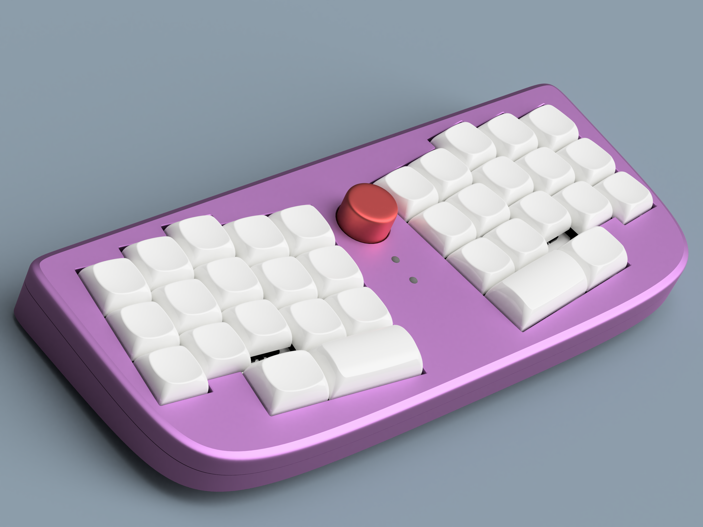
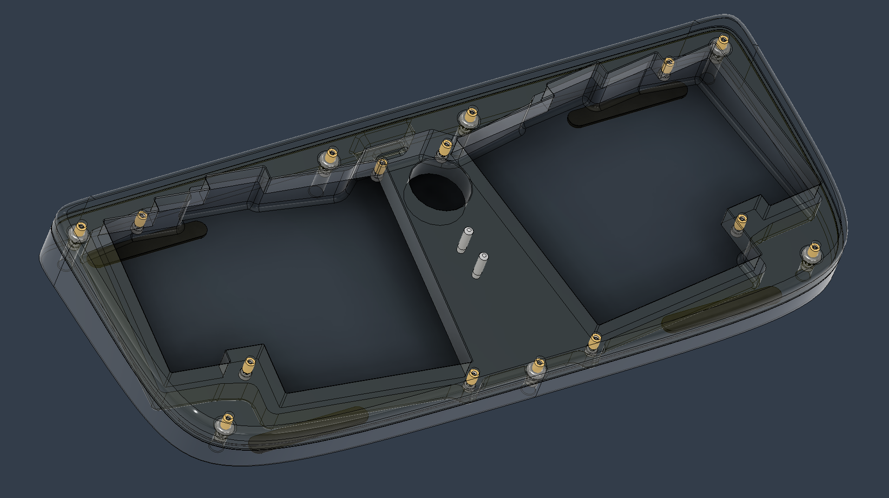

# 3d printable case
---

Knob size is 19mm but can be easily modified with the provided step file.

### Hardware
- 15x: m2 x 3mm x 3mm heatset insert
- 15x: m2 x 6mm or 8mm screws (depend on o-rings used)
- 0 - 23x: 2mm ID x 2mm height x 6mm diameter orings
- 2x: 2.5mm diameter lightpipes
- 4x: [SKUF](https://github.com/Zambumon/SKUF)

