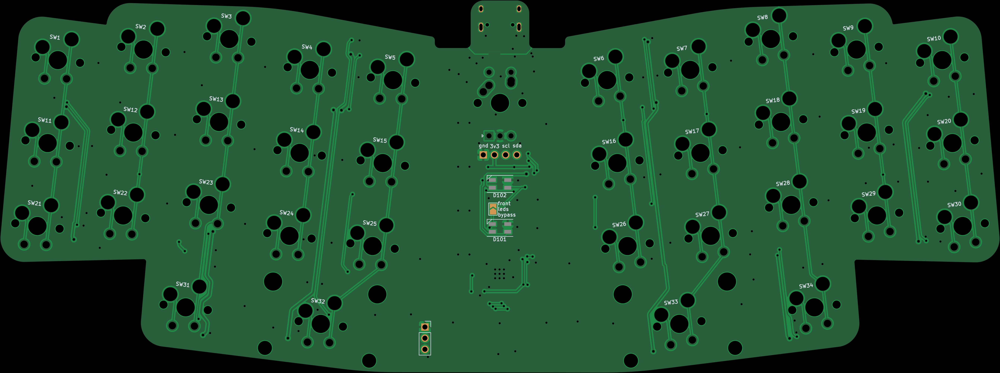
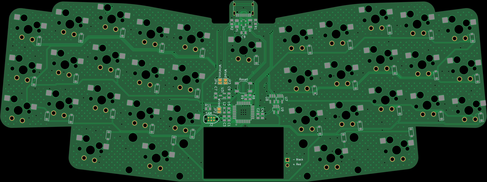

# Le Chiffre Keyboard - STM32 version
-----------

Open sourced PCB originally design by tominabox1 updated to STM32 MCU.

## Changes from the original
* MCU: STM32F072CBT6 (128Kb flash, built-in DFU bootloader, crystal-less)
* RGB leds changed to SK6812 mini for voltage tolerance
* Roundeded PCB outline
* MX hotswap/Alps

## Firmware
* [QMK config](https://github.com/sporkus/qmk_userspace/tree/main/keyboards/sporkus/le_chiffre_32)
* [zmk config](https://github.com/petejohanson/le-chiffre-stm32-zmk-config)
* [pre-compiled vial](./firmware/le_chiffre_32_vial.bin)

## Reset buttons
* DFU button is placed in the legacy reset button position. Plug in the board or push the reset button while DFU button is held down to enable DFU mode.

## Fabrication
* verified production files can be found [here](./pcb_production)
* pcb dimensions: 84.96x227.34mm
* SK6812 mini 3535 has placement marker on "Data In" pin. Don't confuse it with sk6812-HS mini or sk6812 mini-E.

## Misc

#### PCB renders

#### BoM
[interactive BoM](./documentation/stm32_hotswap_chiffre-ibom.html)

#### Schematic
[Schematic pdf](./documentation/stm32_hotswap_chiffre-schematic.pdf)

## Credits
tominabox1 for the [original design](https://github.com/tominabox1/Le-Chiffre-Keyboard)

## Changelog
* v0.2.2: change center switch to soldered instead of hotswap. Group buy.
* v0.2.1: added front led bypass jumper
* v0.2.0: improved protection circuit
* v0.1: working initial prototypes
